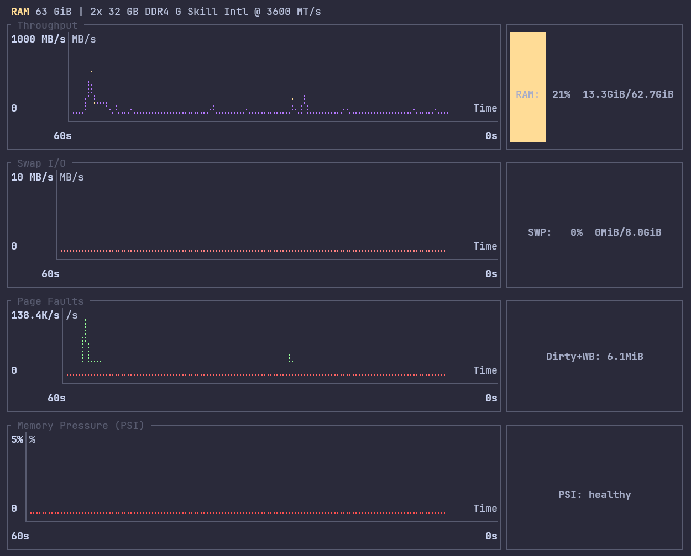

# ram

Real-time RAM and swap monitor for Linux with terminal charts.

Reads `/proc/meminfo`, `/proc/vmstat`, and `/proc/pressure/memory` to display live memory metrics in the terminal using [ratatui](https://github.com/ratatui/ratatui).



## Features

- **Throughput**: page alloc/free rates (MB/s) with auto-scaled Y-axis
- **Swap I/O**: swap in/out rates (MB/s)
- **Page Faults**: minor/major fault rates with dirty/writeback gauge
- **Memory Pressure (PSI)**: kernel stall percentages with health summary
- **Hardware header**: DIMM make, model, type, and speed
- RAM and swap usage gauge bars with used/total labels
- Configurable refresh rate and scrollback window
- `q`, `Esc`, or `Ctrl+C` to quit

## Install

```bash
cargo install --path .
```

Or grab the binary from `target/release/ram` after:

```bash
cargo build --release
```

## Usage

```
ram                  # default 500ms refresh
ram -r 1000          # 1s refresh
ram -s 120           # 2 min scrollback (default 60s)
```

### Hardware info (optional)

To display DIMM details (manufacturer, type, speed) in the header, run once:

```
sudo ram --refresh-hardware
```

This caches the output of `dmidecode` to `~/.cache/ram/hardware.txt`. Run it again if you change your memory sticks. Normal usage (`ram` without sudo) reads the cache and never needs elevated privileges.

## Security notice: running with sudo

`--refresh-hardware` is the **only** reason to run this tool with sudo. When you do, be aware:

- **The entire binary runs as root.** There is no privilege separation — the `dmidecode` call, all Rust code, and every transitive dependency execute with full root access.
- **Supply chain risk.** This project depends on third-party crates (ratatui, crossterm, clap, dirs, anyhow). A compromised dependency update could execute arbitrary code as root on your machine. This is not a theoretical risk — supply chain attacks on package registries (npm, PyPI, crates.io) are [increasingly common](https://blog.phylum.io/the-state-of-software-supply-chain-security/).
- **You should audit what you run.** Before running `sudo ram --refresh-hardware`, consider:
  - Review `Cargo.lock` to verify dependency versions
  - Build from source rather than running a downloaded binary
  - Run it in a VM or container if you want isolation
  - Check that dependency versions haven't been yanked or flagged on [crates.io](https://crates.io)
- **Alternatives to sudo.** If you'd rather not elevate at all, you can populate the cache manually:
  ```
  sudo dmidecode -t memory > ~/.cache/ram/hardware.txt
  ```
  The tool will still run without it — you just won't see DIMM details in the header.

## Disclaimer

This software was generated with the assistance of AI (Claude, Anthropic). It is provided **as-is**, with **no warranty of any kind**, express or implied, including but not limited to the warranties of merchantability, fitness for a particular purpose, and noninfringement. The author(s) accept **no responsibility or liability** for any damage, data loss, security incidents, or other issues arising from its use, including but not limited to issues caused by running this software with elevated (root/sudo) privileges. Use entirely at your own risk. You are solely responsible for reviewing the code and all dependencies, and for determining their suitability and safety for your environment before running them.

## License

MIT
